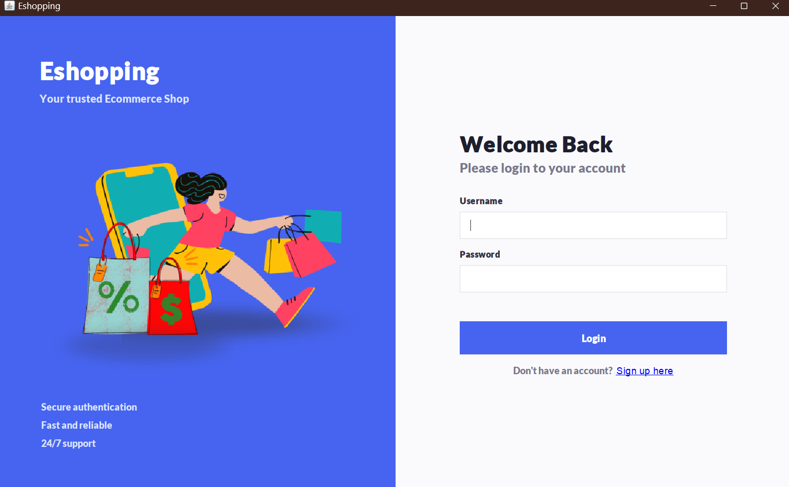
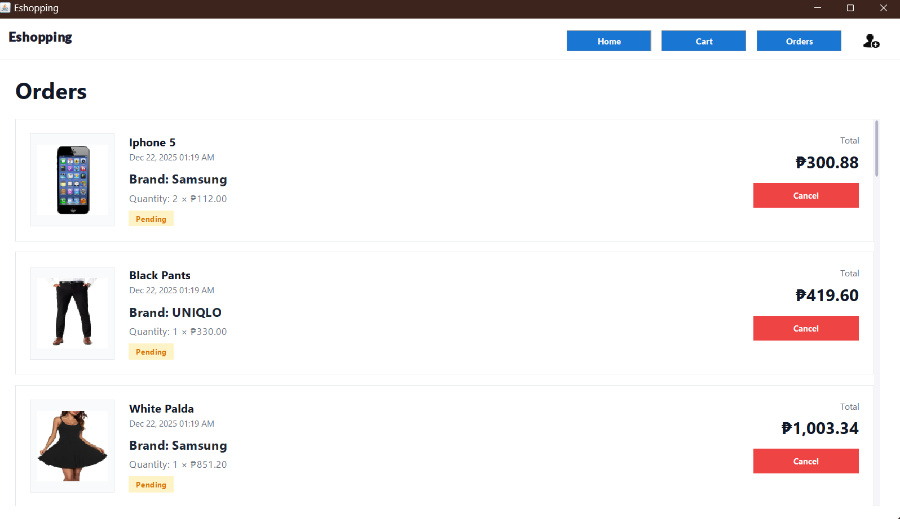
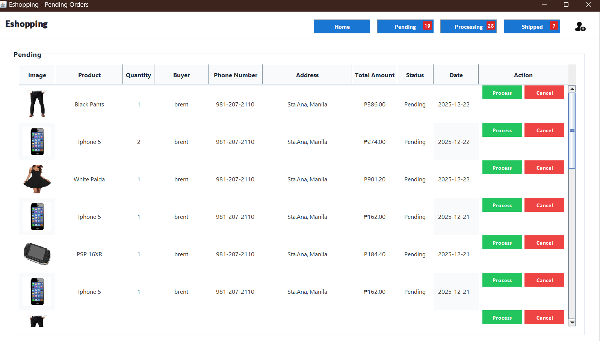
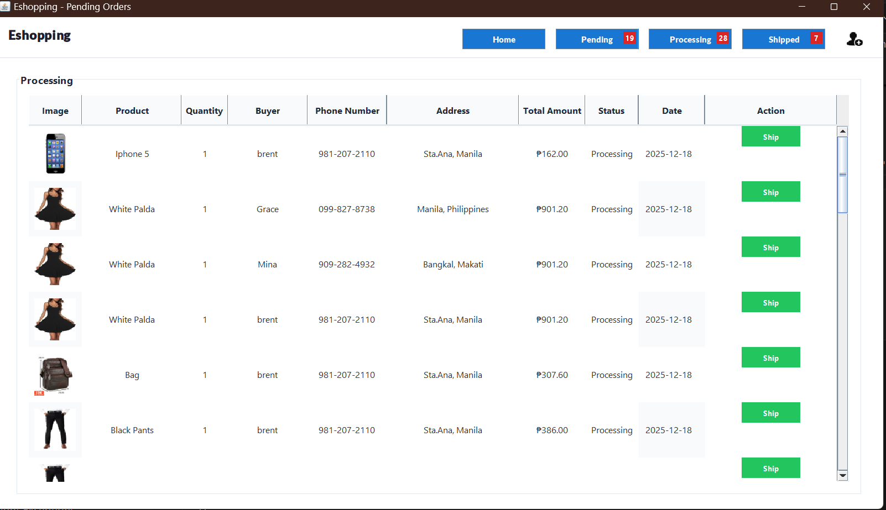
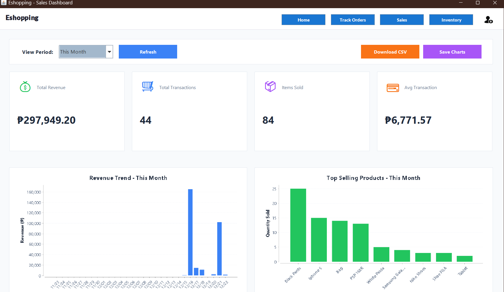

# E-Shopping System

A **Java-based E-Shopping System** designed with two main areas: a **User Portal** for customers to browse and purchase products, and an **Admin Portal** for managing the system and monitoring transactions.

## Screenshots

### Login

  

### Ordering

  

### Pending Orders

  

### Processing Orders

  

### Sales / Purchasing

  

